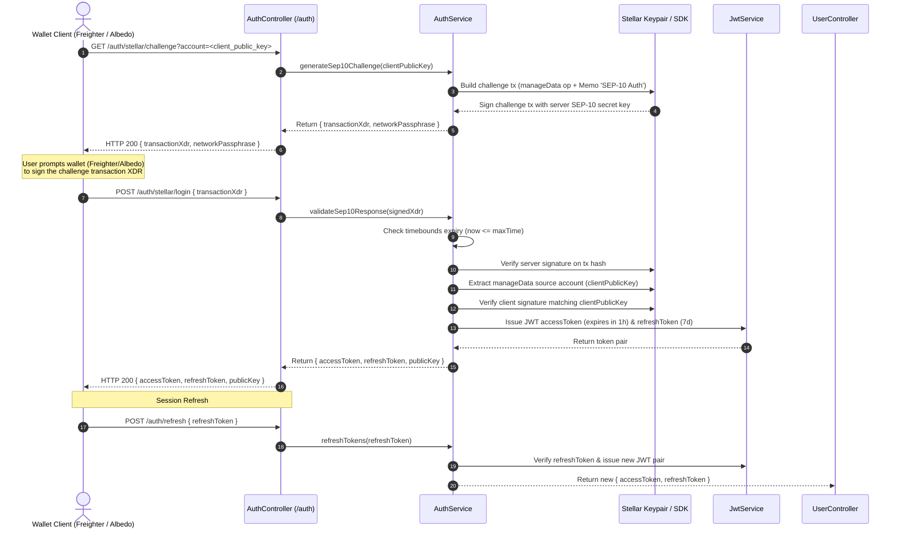

# SEP-10 Stellar Web Authentication Flow

This document details the SEP-10 challenge/response authentication workflow implemented by Agri-Fi's `AuthService` (`backend/src/auth/auth.service.ts`). It outlines the complete sequence from initial challenge generation to wallet signing (Freighter/Albedo), signature verification, JWT issuance, session refresh, error cases, and recovery paths.

---

## 1. End-to-End Sequence Diagram

---

## 2. Walkthrough & Implementation Details

### Phase 1: Challenge Generation
- **Endpoint:** `GET /auth/stellar/challenge`
- **Controller & Service:** `AuthController.getSep10Challenge()` -> `AuthService.generateSep10Challenge()`
- **Mechanism:**
  1. Validates `clientPublicKey` starts with `G` and is 56 characters long.
  2. Generates a random 32-byte hex `nonce`.
  3. Constructs a Stellar `Transaction` with:
     - `sequence`: `'0'`
     - `source`: Server SEP-10 signing account (`SEP10_SIGNING_SECRET`)
     - `fee`: Base fee (`100` stroops)
     - `timebounds`: Min time `0`, Max time `now + 300` (5 minutes expiry)
     - `operation`: `manageData` with name `${SEP10_DOMAIN} SEP-10 Web Auth`, value `nonce`, and `sourceAccount` = `clientPublicKey`.
     - `memo`: Text memo `'SEP-10 Auth'`.
  4. Signs transaction with server's SEP-10 secret key and returns base64 XDR.

### Phase 2: Wallet Signing
- Frontends integrate with wallet extension providers (e.g. Freighter, Albedo, Rチュ, Hana).
- The wallet receives the challenge XDR and network passphrase (`Test SDF Network ; July 2015` or `Public Global Stellar Network ; September 2015`).
- Wallet checks transaction operation details, user approves, and wallet appends client's signature.

### Phase 3: Validation & JWT Issuance
- **Endpoint:** `POST /auth/stellar/login`
- **Controller & Service:** `AuthController.sep10Login()` -> `AuthService.validateSep10Response()`
- **Verification Steps:**
  1. Decodes signed XDR against target `networkPassphrase`.
  2. Enforces timebounds: throws `UnauthorizedException('SEP-10 challenge has expired')` if expired.
  3. Verifies server signature: ensures server signature hint & keypair verify `tx.hash()`. Throws `UnauthorizedException('SEP-10 challenge is not signed by the server')` if invalid.
  4. Locates `manageData` operation (`op.type === 11`) and extracts `sourceAccount` (client public key).
  5. Verifies client signature matching `clientPublicKey` and signature hint. Throws `UnauthorizedException('Invalid client signature on SEP-10 challenge')` if invalid.
  6. Finds or creates corresponding `User` record associated with the Stellar public key.
  7. Issues platform JWT pair (`accessToken` and `refreshToken`).

### Phase 4: Session Refresh
- When `accessToken` expires, client invokes `POST /auth/refresh` with `refreshToken`.
- `AuthService.refreshTokens()` validates the refresh token payload against token blocklist / DB state and returns a fresh token pair.

---

## 4. Error Cases & Recovery Paths

| Error Case | Root Cause | User / Developer Error | Recovery Path |
|---|---|---|---|
| **Expired Challenge** | Transaction submitted after 5-minute timebound window (`now > maxTime`). | Delay between challenge request and wallet confirmation. | Request a new challenge XDR via `GET /auth/stellar/challenge` and re-sign immediately. |
| **Domain Mismatch** | `manageData` key domain doesn't match expected `SEP10_DOMAIN` (default: `agri-fi.com`). | Misconfigured backend environment variable or domain mismatch. | Ensure `SEP10_DOMAIN` matches client domain in `backend/.env`. |
| **Network Mismatch** | Challenge signed on Testnet (`Networks.TESTNET`) but wallet submitted to Mainnet (`Networks.PUBLIC`). | Wallet set to wrong Stellar network (e.g. Freighter testnet vs mainnet switch). | Switch wallet network setting to match `STELLAR_NETWORK` environment variable. |
| **Server Signature Missing** | Challenge XDR altered or built by an unauthenticated server key. | Manually modified XDR or key rotation mismatch. | Re-fetch challenge from trusted platform API server. |
| **Invalid Client Signature** | Signed with keypair different from requested `clientPublicKey`. | Wallet signed using a different account than specified in query param. | Select the matching active account in Freighter / Albedo wallet before signing. |
| **Token Blocklisted** | Refresh token revoked due to logout or security lockout. | Revoked session reuse attempt. | Re-authenticate wallet using SEP-10 challenge/response flow. |

---

## 5. Related Code References

- **SEP-10 Challenge & Response Logic:** [`backend/src/auth/auth.service.ts`](file:///Users/mac/Desktop/codes/drips_network/agri-fi/backend/src/auth/auth.service.ts#L1570-L1680)
- **Stellar Wallet Auth Controller:** [`backend/src/auth/auth.controller.ts`](file:///Users/mac/Desktop/codes/drips_network/agri-fi/backend/src/auth/auth.controller.ts#L375-L410)
- **Stellar Wallet Guard:** [`backend/src/auth/guards/stellar-wallet.guard.ts`](file:///Users/mac/Desktop/codes/drips_network/agri-fi/backend/src/auth/guards/stellar-wallet.guard.ts)
- **Docker & Compose Environment Config:** [`docker-compose.yml`](file:///Users/mac/Desktop/codes/drips_network/agri-fi/docker-compose.yml)
