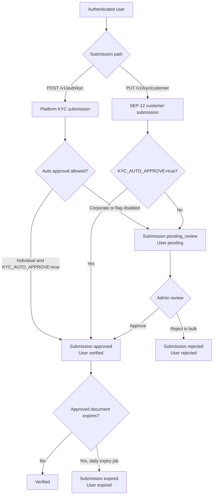

# KYC Topology

This document describes the KYC state transitions implemented by the API. It covers platform KYC submissions, SEP-12 customer records, manual review, and the scheduled document-expiry job.

## State Model

| Record | States |
| --- | --- |
| `kyc_submissions.status` | `pending_review`, `approved`, `rejected`, `expired` |
| `users.kyc_status` | `pending`, `verified`, `rejected`, `expired` |
| SEP-12 response status | `PROCESSING`, `VERIFIED`, `REJECTED` |

`pending_review` maps to a user who remains `pending` and to SEP-12 `PROCESSING`. An approved submission sets the user to `verified` and is returned as SEP-12 `VERIFIED`. Rejection sets the user to `rejected`; expiry sets both records to `expired` and causes KYC-protected actions to be denied.

## Lifecycle



## Submission Paths and Auto Approval

### Platform KYC

`POST /v1/auth/kyc` creates a `kyc_submissions` row. It writes `approved` and changes the user to `verified` only when `KYC_AUTO_APPROVE=true` and `isCorporate` is false. Corporate submissions always enter `pending_review`, even when the flag is enabled. Corporate metadata is stored on the user before the manual decision.

### SEP-12 KYC

`PUT /v1/kyc/customer` normalizes the submitted SEP-12 fields, updates the user profile, and stores the normalized payload in `kyc_submissions.sep12_data`. When `KYC_AUTO_APPROVE=true`, the submission is approved and the user becomes `verified`; otherwise it is `pending_review` and the user remains `pending`.

The SEP-12 payload has no corporate classification branch. Therefore its auto-approval decision is controlled only by `KYC_AUTO_APPROVE`, unlike the platform submission path.

### Manual Review

Admin-only routes provide the implemented review actions:

- `POST /v1/admin/kyc/:userId/approve` approves the most recent `pending_review` submission for that user.
- `POST /v1/admin/kyc/:id/approve-corporate` approves the specified corporate submission.
- `PATCH /v1/admin/kyc/bulk` approves or rejects the most recent `pending_review` submission for each listed user. Rejection requires a reason.

Approval writes the submission status, updates `users.kyc_status` to `verified`, records an admin action, and queues a notification. Bulk rejection changes both records to `rejected`, records the action and audit event, and queues a rejection notification.

## Pending Review Queue

Use the submission status, not only `users.kyc_status`, to build the reviewer queue. A user can have more than one submission, while the single-user and bulk review actions operate on the most recent pending submission.

```sql
SELECT DISTINCT ON (s.user_id)
  s.id,
  s.user_id,
  s.is_corporate,
  s.created_at,
  u.email,
  u.kyc_status
FROM kyc_submissions AS s
JOIN users AS u ON u.id = s.user_id
WHERE s.status = 'pending_review'
ORDER BY s.user_id, s.created_at DESC;
```

For backlog age and SLA reporting, retain every pending submission instead of deduplicating by user:

```sql
SELECT s.id, s.user_id, s.is_corporate, s.created_at, u.email
FROM kyc_submissions AS s
JOIN users AS u ON u.id = s.user_id
WHERE s.status = 'pending_review'
ORDER BY s.created_at ASC;
```

## Scheduled Jobs

`KycCronService.checkKycExpirations` is the only implemented KYC scheduler. It runs daily at midnight using the application scheduler's configured process timezone. It considers only `approved` submissions with `document_expires_at` set.

| Condition | Job action |
| --- | --- |
| 30, 14, or 7 days before expiry | Send email and in-app reminder, record the reminder timestamp, and audit the event. |
| On or after expiry | Set the submission to `expired`, set the user to `expired`, notify the user, and write an audit event. |

The job does not review `pending_review` submissions, assign priority, or escalate an overdue review. No `kyc-approval-cron.service.ts` or equivalent pending-review SLA scheduler exists in this repository.

## Compliance Controls to Tighten

- Replace the global `KYC_AUTO_APPROVE` switch with explicit eligibility checks, such as required-document completeness, sanctions screening, jurisdiction, document authenticity, and risk score.
- Apply the same corporate-risk treatment to SEP-12 submissions, or prevent SEP-12 auto approval for accounts that require corporate review.
- Add a pending-review scheduler with documented SLA thresholds, priority fields, reviewer assignment, and escalation notifications. Its query should target `status = 'pending_review'` and record each escalation for audit.
- Set an explicit timezone for the expiry scheduler and monitor failed reminder or expiry executions.
- Require and persist reviewer reasons for all manual outcomes, including single approvals, and preserve a complete review decision history.

## Related Code

- `backend/src/stellar/sep12.service.ts`
- `backend/src/auth/auth.service.ts`
- `backend/src/auth/admin.controller.ts`
- `backend/src/auth/kyc-cron.service.ts`
- `backend/src/auth/entities/kyc-submission.entity.ts`
