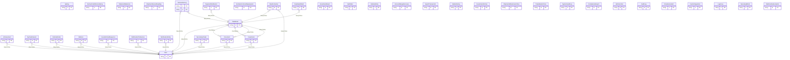

# Database Schema ER Diagram

> Auto-generated from TypeORM entities by `npm run doc:diagram`. Do not edit manually.

```mermaid
erDiagram
    %% Domain: USERS
    Achievement {
        string id PK
    }
    ApiKey {
        string id PK
    }
    KycSubmission {
        string id PK
    }
    ReferralCode {
        string id PK
    }
    Referral {
        string id PK
    }
    User {
        string id PK
    }
    InvestorEmailSequence {
        string id PK
    }
    NotificationPreference {
        string id PK
    }
    NotificationEntity {
        string id PK
    }
    FarmerCreditScoreHistory {
        string id PK
    }
    %% Domain: DEALS
    ShipmentMilestone {
        string id PK
    }
    ShipmentSensorReading {
        string id PK
    }
    DealCoFarmer {
        string id PK
    }
    DealHealthAlert {
        string id PK
    }
    Document {
        string id PK
    }
    TradeDeal {
        string id PK
    }
    SorobanContractDeployment {
        string id PK
    }
    %% Domain: INVESTMENTS
    PaymentDistribution {
        string id PK
    }
    TransactionLog {
        string id PK
    }
    InvestmentEvent {
        string id PK
    }
    Investment {
        string id PK
    }
    SellOrder {
        string id PK
    }
    SecondaryTrade {
        string id PK
    }
    OutboxEntity {
        string id PK
    }
    %% Domain: PAYMENTS
    AccountMergeRecovery {
        string id PK
    }
    Sep24Transaction {
        string id PK
    }
    StellarHistory {
        string id PK
    }
    TransactionLog {
        string id PK
    }
    %% Domain: COMPLIANCE
    InvestmentArchive {
        string id PK
    }
    ShipmentMilestoneArchive {
        string id PK
    }
    TradeDealArchive {
        string id PK
    }
    SystemAuditLog {
        string id PK
    }
    ComplianceReport {
        string id PK
    }
    AdminAction {
        string id PK
    }
    AuditLog {
        string id PK
    }
    ComplianceAlert {
        string id PK
    }
    FeeConfiguration {
        string id PK
    }
    LoginLog {
        string id PK
    }
    SecurityIpBlock {
        string id PK
    }
    WebhookSubscription {
        string id PK
    }

    %% Relationships
    Achievement }o--|| User : "ManyToOne"
    KycSubmission }o--|| User : "ManyToOne"
    ReferralCode }o--|| User : "ManyToOne"
    Referral }o--|| User : "ManyToOne"
    InvestorEmailSequence }o--|| User : "ManyToOne"
    PaymentDistribution }o--|| TradeDeal : "ManyToOne"
    TransactionLog }o--|| User : "ManyToOne"
    TransactionLog }o--|| TradeDeal : "ManyToOne"
    Investment }o--|| TradeDeal : "ManyToOne"
    Investment }o--|| User : "ManyToOne"
    SecondaryTrade }o--|| User : "ManyToOne"
    NotificationPreference }o--|| User : "ManyToOne"
    NotificationEntity }o--|| User : "ManyToOne"
    DealCoFarmer }o--|| TradeDeal : "ManyToOne"
    DealCoFarmer }o--|| User : "ManyToOne"
    DealHealthAlert }o--|| TradeDeal : "ManyToOne"
    Document }o--|| TradeDeal : "ManyToOne"
    Document }o--|| User : "ManyToOne"
    TradeDeal }o--|| User : "ManyToOne"
    TradeDeal ||--o{ Document : "OneToMany"
    TradeDeal ||--o{ Investment : "OneToMany"
```

